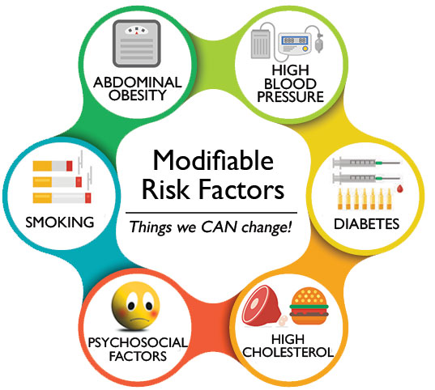
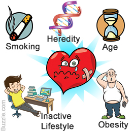

# Risk Factors Of Heart Attack

### Team Members:
* Yannick Kalukuta [yanowen](https://github.com/Yanrice)
* Vijay Bagavatula [vijayb023](https://github.com/Vijayb023)
* Vin Dixit                 [vinayakdixit](https://github.com/vinayakdixit)
* Dinesh Lamba          **drlamba502**
* Adil Sarwar             **asarwar1**
* Kendall Gouldthorpe  [kgouldthorpe](https://github.com/kgouldthorpe)

## Project Objective:
We will be using data that includes age, weight, gender, and various vitals collected from **70,000 users** to test our hypothesis on the correlation of **lifestyle choices**, **blood indices**, and **body indicators**.

**Looking specifically at**:
1. Does **alcohol** consumption lead to greater risk of heart attack?
2. Does **smoking** lead to greater risk of heart attack?
3. Does being **physically active** negate certain other factors that increase risk of heart attack?
4. Is one **gender** more prone to heart attack then the other?
## Methodology:
We will use presence or absence of cardiovascular disease as the target variable. Other parameters will be independent variables . We will split the data in train and test data sets. We will create the model using the train dataset and run that model on our test dataset to predict to see if our outcome matches our hypothesis.
### Hypothesis:
Given certain lifestyle choices, blood indices, and body indicators, we can predict the propensity of heart attack.
### Null:
There is no **correlation** between lifestyle choice, blood indices, and body indicators to predict propensity of heart attack.
#### Datasets to be Used:  Cardiovascular Disease Dataset
[Kaggle:sulianova/cardiovascular-disease-dataset](https://www.kaggle.com/sulianova/cardiovascular-disease-dataset)
#### File Type: `.csv`
Rows: `70,000`
### Data includes:
1. **Age** | Objective Feature | age | `int` (days)
2. **Height** | Objective Feature | height | `int` (cm)
3. **Weight** | Objective Feature | weight | `float` (kg)
4. **Gender** | Objective Feature | gender | `categorical` code
5. **Systolic blood pressure** | Examination Feature | ap_hi | `int`
6. **Diastolic blood pressure** | Examination Feature | ap_lo | `int`
7. **Cholesterol** | Examination Feature | cholesterol | 1: normal, 2: above normal, 3: well above normal
8. **Glucose** | Examination Feature | gluc | 1: normal, 2: above normal, 3: well above normal
9. **Smoking** | Subjective Feature | smoke | binary
10. **Alcohol intake** | Subjective Feature | alco | `binary`
11. **Physical activity** | Subjective Feature | active | binary
12. **Presence or absence of cardiovascular disease** | Target Variable | cardio | binary
